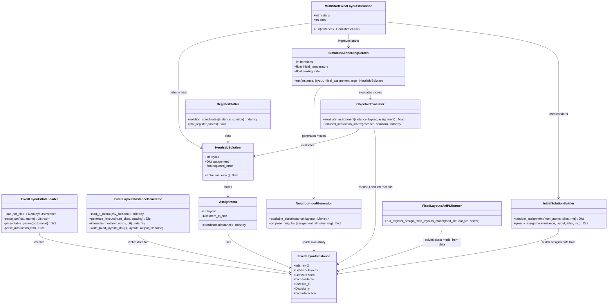

# 7 - Provide a UML class diagram for encoding the problem and the proposed heuristic.

The chosen version is the **Fixed Layout Register Design** problem, and the proposed heuristic is the multi-start simulated annealing method described in Question 6.

The implementation is available in:

* [heuristics/fixed_layout_register_design.py](../heuristics/fixed_layout_register_design.py)

The exact AMPL model used for comparison is:

* [ampl/register_design_fixed_layouts.mod](../ampl/register_design_fixed_layouts.mod)

The instance generator is:

* [tools/generate_fixed_layouts_instance.py](../tools/generate_fixed_layouts_instance.py)

## 1. UML Class Diagram



## 2. Main Classes and Responsibilities

### `FixedLayoutsInstance`

Represents a complete fixed-layout register design instance.

It stores:

* the target QUBO matrix \(Q\);
* the available layouts;
* the calibrated trapping sites;
* the site availability matrix;
* the site coordinates;
* the precomputed physical interaction matrix \(I_{\ell st}\).

In the current implementation, this class appears as a Python dataclass in:

* [heuristics/fixed_layout_register_design.py](../heuristics/fixed_layout_register_design.py)

### `FixedLayoutsDataLoader`

Loads an AMPL `.dat` instance and converts it into a `FixedLayoutsInstance`.

It is responsible for parsing:

* `param Q`;
* `set LAYOUTS`;
* `set SITES`;
* `param Available`;
* `param Site_X`;
* `param Site_Y`;
* `param Interaction`.

In the current implementation, this responsibility is handled by:

* `load_fixed_layouts_instance`
* `_parse_set`
* `_parse_table_param`
* `_parse_interaction`

### `FixedLayoutsInstanceGenerator`

Creates fixed-layout instances from a QUBO matrix.

This class corresponds to the tool:

* [tools/generate_fixed_layouts_instance.py](../tools/generate_fixed_layouts_instance.py)

It builds line, grid, and circle layouts, computes site-to-site interactions, and writes the resulting AMPL `.dat` file.

### `Assignment`

Represents a candidate assignment of atoms to sites in one selected layout.

Conceptually, an assignment is:

$$
\pi(i)=s
$$

meaning atom \(i\) is assigned to site \(s\).

In the Python implementation, this is represented as a dictionary:

```python
{
    atom: site
}
```

### `HeuristicSolution`

Stores the best solution found by the heuristic.

It contains:

* the selected layout;
* the atom-to-site assignment;
* the squared Frobenius error.

In the current implementation, this class appears as:

```python
@dataclass
class HeuristicSolution:
    layout: str
    assignment: dict
    squared_error: float
```

### `ObjectiveEvaluator`

Evaluates the quality of a candidate assignment.

For a layout \(\ell\) and assignment \(\pi\), it computes:

$$
F(\ell,\pi)
=
\sum_{i<j}
\left(
I_{\ell,\pi(i),\pi(j)}
-Q_{ij}
\right)^2
$$

In the current implementation, this responsibility is handled by:

* `evaluate_assignment`
* `induced_interaction_matrix`

### `InitialSolutionBuilder`

Builds initial feasible assignments for the heuristic.

It provides two strategies:

* random initialization;
* greedy initialization.

In the current implementation, this responsibility is handled by:

* `random_assignment`
* `greedy_assignment`

### `NeighborhoodGenerator`

Generates neighboring assignments during the local search.

The implemented neighborhood contains:

* swap moves, where two atoms exchange sites;
* relocation moves, where one atom moves to an unused available site.

In the current implementation, this responsibility is handled by:

* `available_sites`
* `propose_neighbor`

### `SimulatedAnnealingSearch`

Improves one initial assignment using simulated annealing.

At each iteration, it:

1. proposes a neighboring assignment;
2. evaluates the objective difference \(\Delta\);
3. accepts improving moves;
4. sometimes accepts worse moves with probability:

$$
\exp\left(-\frac{\Delta}{T}\right)
$$

In the current implementation, this responsibility is handled by:

* `run_simulated_annealing`

### `MultiStartFixedLayoutsHeuristic`

Coordinates the full heuristic.

It loops over:

* every feasible layout;
* several restarts for each layout;
* one simulated annealing search per restart.

It returns the best `HeuristicSolution` found.

In the current implementation, this responsibility is handled by:

* `run_fixed_layouts_heuristic`

### `RegisterPlotter`

Converts the selected assignment into coordinates and plots the register using Pulser and Matplotlib.

In the current implementation, this responsibility is handled by:

* `solution_coordinates`
* `plot_register`

### `FixedLayoutsAMPLRunner`

Solves the exact MIQP version of the same problem using AMPL.

This class is not part of the heuristic itself, but it is useful for comparison.

The implementation is available in:

* [ampl/scripts/run_register_design_fixed_layouts.py](../ampl/scripts/run_register_design_fixed_layouts.py)

## 3. Relationship Between the UML and the Current Code

The current Python implementation is intentionally lightweight and uses dataclasses plus functions rather than a fully object-oriented class hierarchy.

Therefore, the UML diagram above should be read as the **logical architecture** of the implementation:

* `FixedLayoutsInstance` and `HeuristicSolution` already exist as concrete dataclasses.
* The other UML classes correspond to groups of functions with clear responsibilities.
* If the heuristic grows, these function groups can be refactored into concrete Python classes without changing the algorithmic design.

This structure separates the problem into four clean layers:

1. **Data layer**: load or generate fixed-layout instances.
2. **Model layer**: represent layouts, sites, assignments, and solutions.
3. **Search layer**: generate initial assignments and improve them with simulated annealing.
4. **Output layer**: print, compare, and plot the final register.
